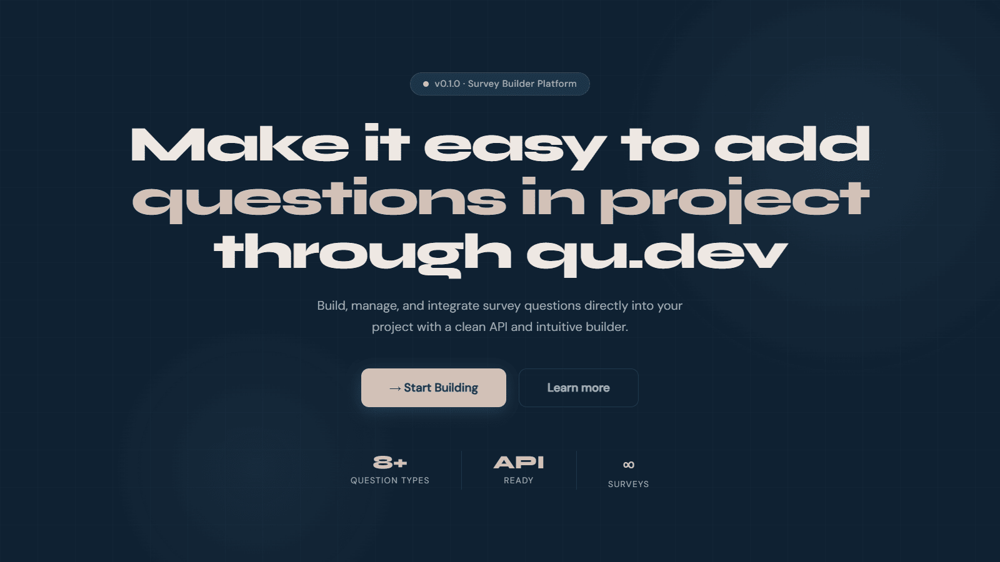
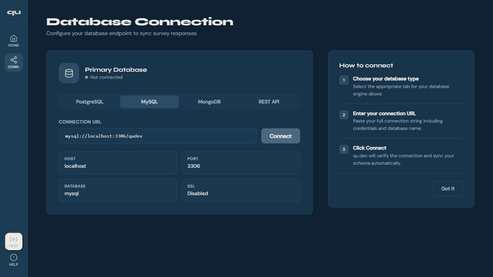
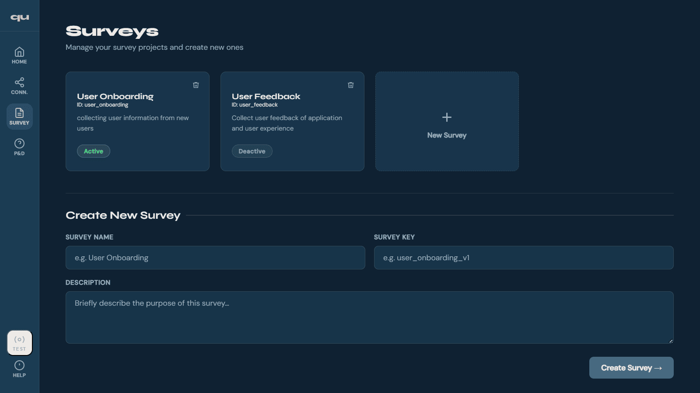
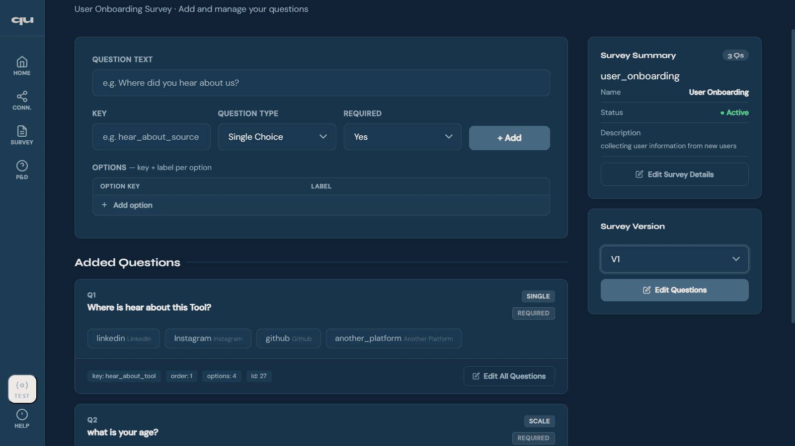
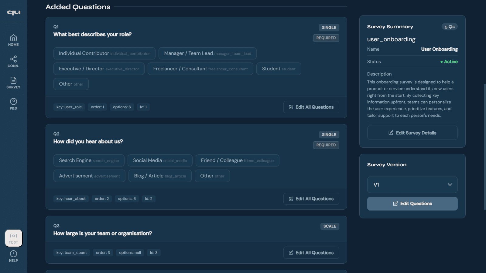
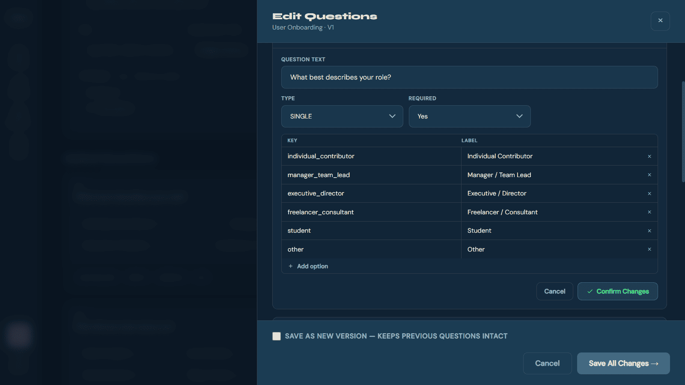
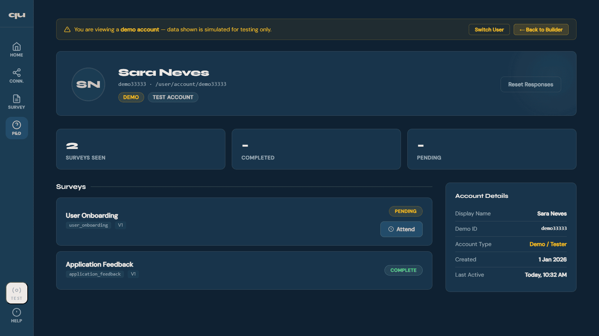
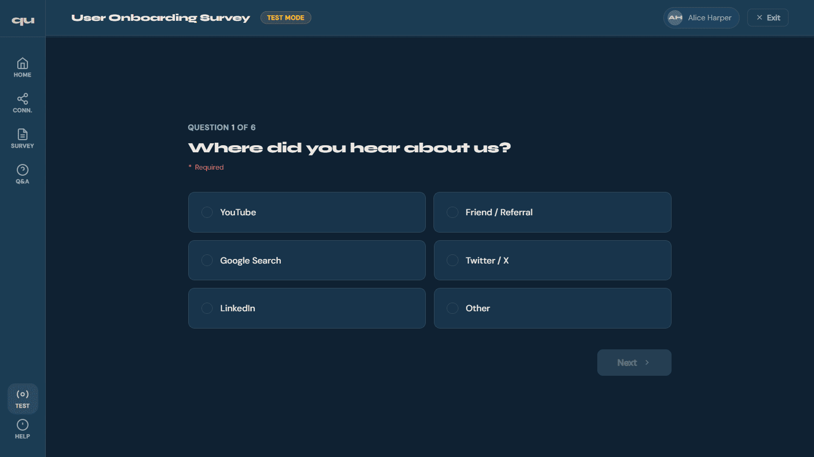
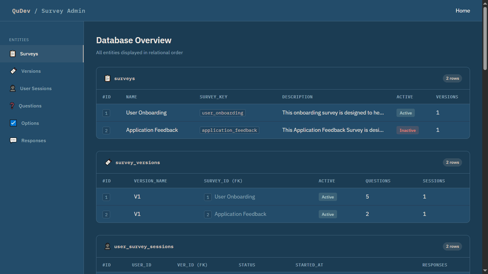

# qu.dev — Survey Builder Platform

> An open-source developer tool that automatically generates a clean, relational database structure for survey systems — with version controlling built in.

<div align="center">


</div>

---

## 🧩 What is qu.dev?

Building surveys into a project sounds simple — until you have to design the database yourself.

How should the tables relate? Where does versioning live? How do you add question types without breaking existing responses?

**qu.dev** solves this. It automatically generates a best-practice relational database schema for your survey system and gives you a full web interface to build, manage, version, and test surveys — without writing a single entity from scratch.

---

## 📸 Screenshots

<div align="center">
<table>
<tr>
<td></td>
<td></td>
</tr>
<tr>
<td></td>
<td></td>
</tr>
<tr>
<td></td>
<td></td>
</tr>
<tr>
<td></td>
<td></td>
</tr>
<tr>
<td colspan="2"></td>
</tr>
</table>
</div>

---

## ✨ Features

- 🗄️ **Auto-generated relational DB schema** — surveys, versions, questions, options, and responses structured automatically following best practices
- 🔄 **Version controlling per survey** — save changes as a new version without breaking existing response data
- 📋 **Unlimited survey sections** — create and manage as many surveys as your project needs
- ❓ **Multiple question types** — single choice, multiple choice, scale, text, and more
- 🧪 **Built-in demo testing** — test each survey with simulated users before going live
- 🖨️ **Print responses** — print user response data directly from the UI
- 🔓 **100% developer control** — open source, self-hosted, no black-box logic, no security concerns

---

## 🗄️ Database Structure

qu.dev automatically creates and manages the following relational schema:

```
surveys
└── survey_versions          → Version history per survey
    └── user_survey_sessions → User session tracking per version
        └── questions        → Questions linked to each version
            ├── options      → Answer options per question
            └── responses    → Stored user responses per session
```

> The schema is designed to be clean, extendable, and easy to integrate into any existing Spring Boot project.

---

## 🛠️ Tech Stack

| Layer      | Technology                          |
|------------|-------------------------------------|
| Backend    | Java 17, Spring Boot                |
| Frontend   | Thymeleaf, HTML, CSS, JavaScript    |
| Database   | MySQL 8+                            |
| Build Tool | Maven                               |

---

## 📦 Getting Started

### Prerequisites

- Java 17+
- MySQL 8+
- Maven

### Installation

```bash
# 1. Clone the repository
git clone https://github.com/Asfar-07/qu.dev.git
cd qu.dev

# 2. Create the database
mysql -u root -p -e "CREATE DATABASE qudev;"

# 3. Configure your database connection
# Edit src/main/resources/application.properties
spring.datasource.url=jdbc:mysql://localhost:3306/qudev
spring.datasource.username=YOUR_USERNAME
spring.datasource.password=YOUR_PASSWORD

# 4. Run the application
./mvnw spring-boot:run
```

### Access

Open your browser and navigate to: `http://localhost:8080`

---

## 📖 How to Use

1. **Connect your database** — configure your MySQL connection from the Connection page
2. **Create a survey** — add a name, key, and description
3. **Build questions** — add questions with types, options, and required flags
4. **Version your survey** — save changes as a new version to preserve existing response data
5. **Test it** — use the built-in demo testing environment to validate your survey before going live
6. **Integrate** — copy the auto-generated entity and service code into your Spring Boot project

> Requires basic knowledge of relational databases and REST API integration to connect your backend.

---

## 🔗 Integration

If you're using Spring Boot, you can copy the entity and service logic directly from qu.dev into your project. The schema is designed to plug in cleanly with minimal changes.

```java
// Example: fetch active survey with version
surveyRepository.findByKeyAndActiveTrue("user_onboarding");
```

---

## 🗺️ Roadmap

- [ ] Response analytics dashboard
- [ ] Export schema as SQL / JSON
- [ ] Support for PostgreSQL and MongoDB
- [ ] Conditional question logic
- [ ] Multi-language support

---

## 🤝 Contributing

Contributions, feedback, and suggestions are very welcome!

1. Fork the repository
2. Create your feature branch: `git checkout -b feature/your-feature`
3. Commit your changes: `git commit -m 'Add your feature'`
4. Push to the branch: `git push origin feature/your-feature`
5. Open a Pull Request

Have an idea or found a bug? Open an issue in the repository — all feedback helps.

---

## 👤 Author

**Asfar Muhammed N S**

[](https://github.com/Asfar-07)

---

## 📄 License

This project is open source and available under the [MIT License](LICENSE).

---

<div align="center">
  <sub>If this saves even one developer from the survey setup headache — it's worth it. 🙌</sub>
</div>
